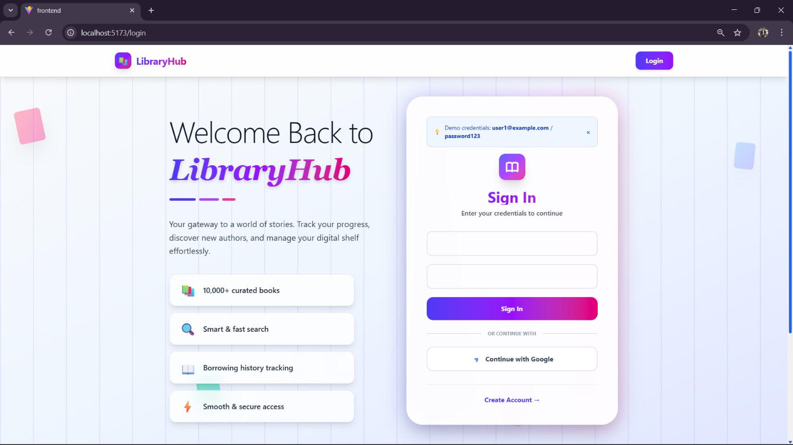
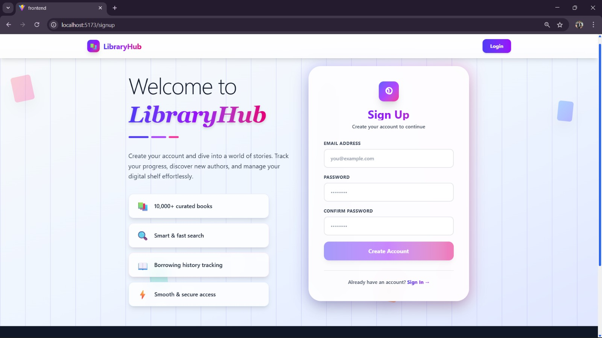
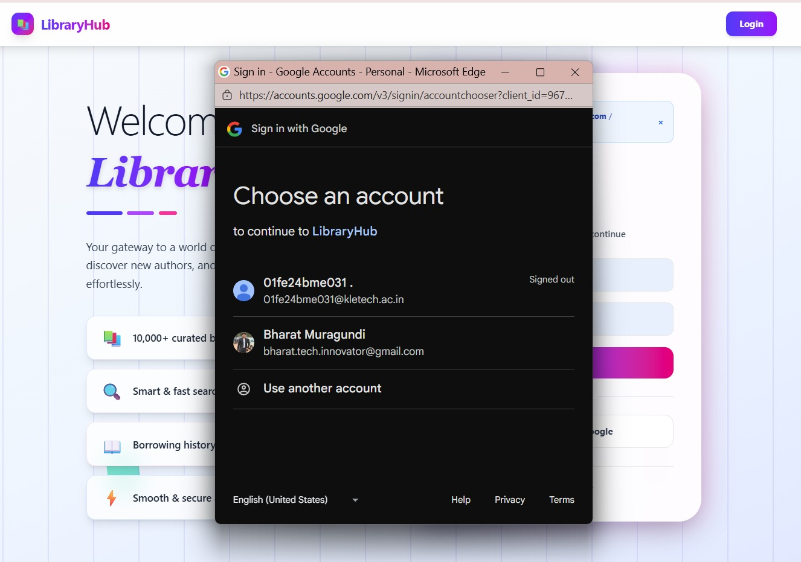
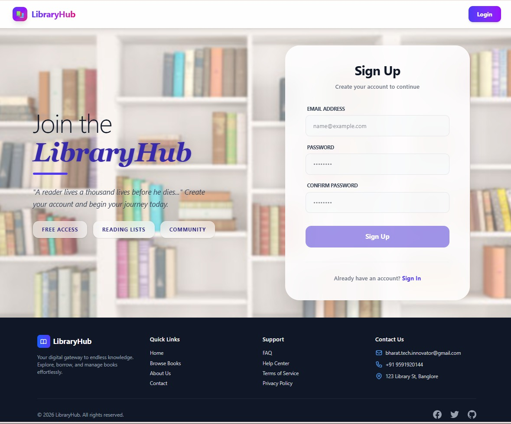
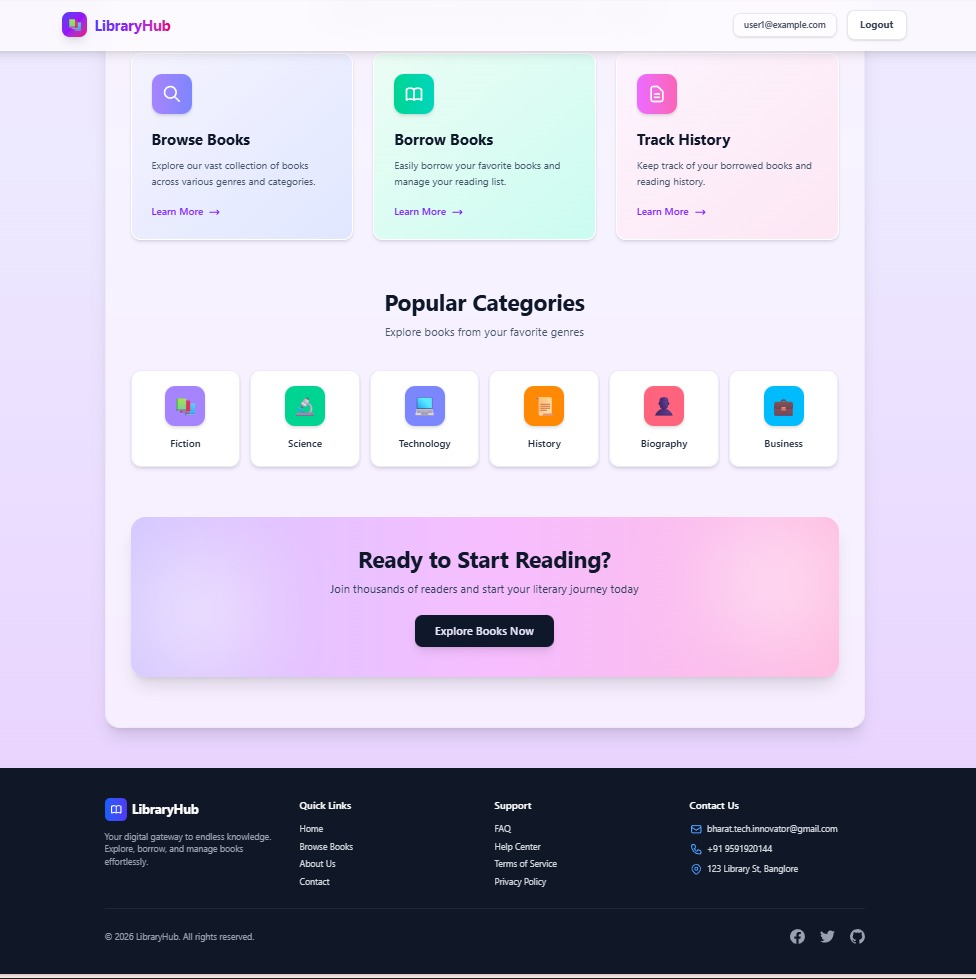
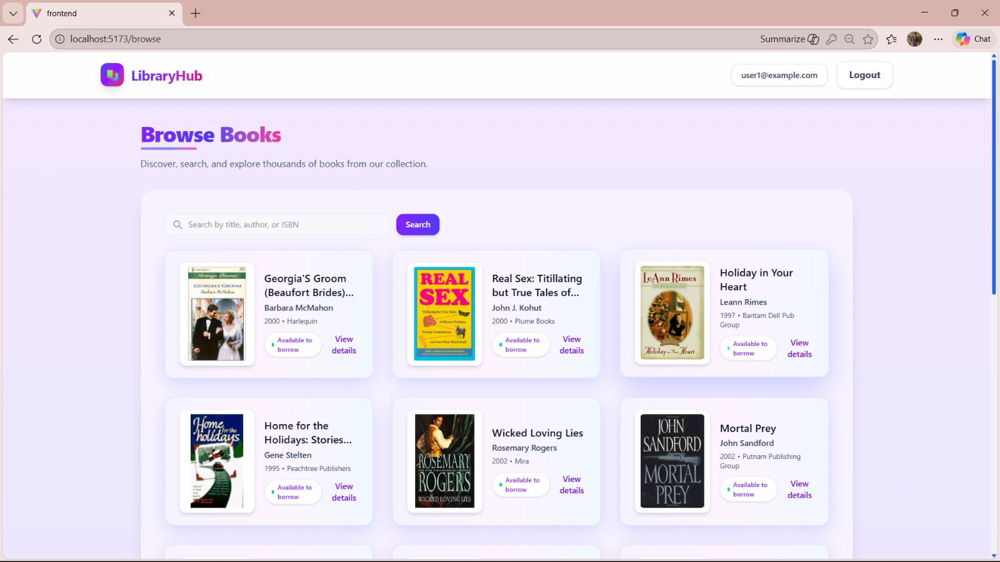
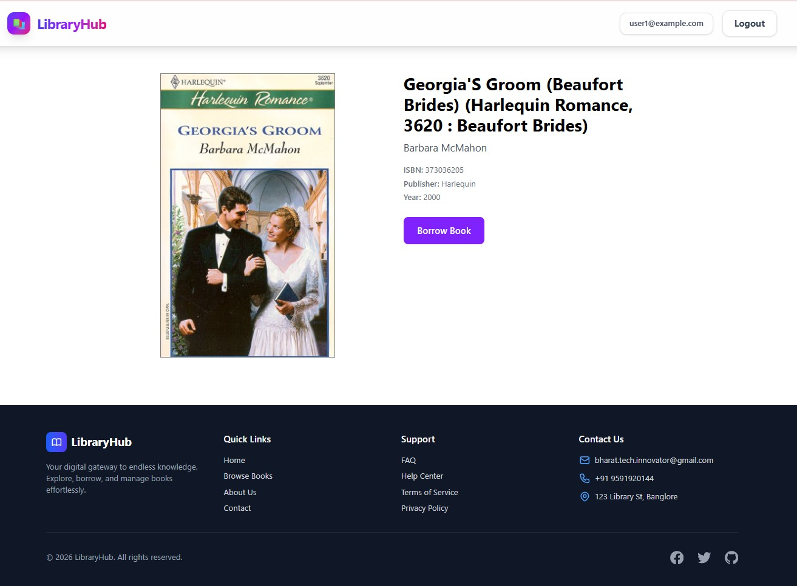
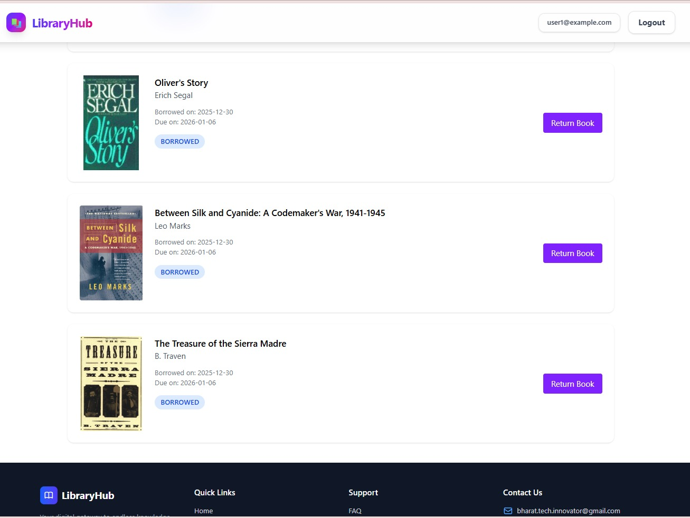

# 📚 LibraryHub - Library Management System

A modern, full-stack library management system that makes browsing, borrowing, and managing books effortless. Built with Spring Boot and React, LibraryHub offers a clean interface for users to explore a vast collection of books while providing robust authentication and borrowing features.

🔐 Authentication (Login & Signup)
<div align="center"> <!-- Row 1 --> <table> <tr> <td align="center">  <br/><b>Login</b> </td> <td align="center">  <br/><b>Signup</b> </td> </tr> </table> <br/> <!-- Row 2 --> <table> <tr> <td align="center">  <br/><b>Google Signup</b> </td> <td align="center">  <br/><b>Alternative Login / Signup</b> </td> </tr> </table> </div>


📚 Application Interface 
<div align="center"> <!-- Group 1: 3 images --> <table> <tr> <td align="center">  <br/><b>Home Page</b> </td> <td align="center">  <br/><b>Home Page (Alt)</b> </td> <td align="center">  <br/><b>Browse Books</b> </td> </tr> </table> <br/> <!-- Group 2: 2 images centered --> <table> <tr> <td align="center">  <br/><b>Book Details</b> </td> <td align="center">  <br/><b>Borrow History</b> </td> </tr> </table> </div>


## ✨ Features

### Authentication & Security
- JWT-based authentication for secure sessions
- Google OAuth 2.0 integration for quick sign-in
- Role-based access control (USER/ADMIN)
- Encrypted password storage

### Book Management
- Browse through 50,000+ books from various genres
- Advanced search by title, author, or ISBN
- Detailed book information with cover images
- Real-time availability status

### Borrowing System
- One-click book borrowing
- Automatic due date calculation
- Borrow history tracking
- Easy book returns with status updates

### User Experience
- Clean, modern UI built with Tailwind CSS v4
- Responsive design for all devices
- Intuitive navigation
- Fast search and filtering

## 🏗️ Tech Stack

### Backend
- **Java 21** - Modern Java features
- **Spring Boot** - Application framework
- **Spring Security** - Authentication & authorization
- **JWT** - Token-based authentication
- **MongoDB** - NoSQL database
- **Maven** - Dependency management

### Frontend
- **React 18** - UI library
- **Vite** - Build tool & dev server
- **Tailwind CSS v4** - Styling framework
- **React Router** - Client-side routing
- **Google OAuth** - Social authentication

### Database
- **MongoDB Atlas** - Cloud database
  - Collections: Users, Books, Borrows
  - 50K+ book records with metadata
  - Indexed searches for performance
 


## 🗄️ Database Schema

### Users Collection
```javascript
{
  _id: ObjectId,
  email: String,
  password: String (encrypted),
  role: "USER" | "ADMIN",
  _class: "com.library.backend.model.User"
}
```

### BooksCollection (50K documents)
```javascript
{
  _id: ObjectId,
  ISBN: String,
  Book-Title: String,
  Book-Author: String,
  Year-Of-Publication: Number,
  Publisher: String,
  Image-URL-S: String,
  Image-URL-M: String,
  Image-URL-L: String
}
```

### Borrows Collection
```javascript
{
  _id: ObjectId,
  userId: String,
  bookId: String,
  borrowedAt: Date,
  dueDate: Date,
  returnedAt: Date | null,
  status: "BORROWED" | "RETURNED",
  _class: "com.library.backend.model.Borrow",
  author: String,
  imageUrl: String,
  title: String
}
```

## 🔐 Authentication Flow

### Local Registration/Login
1. User enters email and password
2. Backend validates credentials
3. Password is encrypted using BCrypt
4. JWT token is generated with user details
5. Token is sent back to frontend
6. Frontend stores token and uses it for authenticated requests

### Google OAuth Flow
1. User clicks "Continue with Google"
2. Google authentication popup opens
3. User selects Google account
4. Google returns ID token to frontend
5. Frontend sends ID token to backend
6. Backend verifies token with Google
7. User is created or fetched from database
8. JWT token is generated
9. Token is returned to frontend for session management

## 📌 API Endpoints

### Authentication
| Method | Endpoint | Description |
|--------|----------|-------------|
| POST | `/api/auth/signup` | Register new user |
| POST | `/api/auth/login` | Login with credentials |
| POST | `/api/auth/google` | Google OAuth login |

### Books
| Method | Endpoint | Description |
|--------|----------|-------------|
| GET | `/api/books` | Get all books |
| GET | `/api/books/{id}` | Get book details |
| GET | `/api/books/search` | Search books |

### Borrowing
| Method | Endpoint | Description |
|--------|----------|-------------|
| POST | `/api/borrow` | Borrow a book |
| POST | `/api/borrow/return/{id}` | Return book |
| GET | `/api/borrow/history` | Borrow history |

### User
| Method | Endpoint | Description |
|--------|----------|-------------|
| GET | `/api/users/profile` | Get user profile |
| PUT | `/api/users/profile` | Update profile |

## 🚀 Getting Started

### Prerequisites
- Java 21 or higher
- Node.js 18+ and npm
- MongoDB (local or Atlas)
- Maven 3.8+

### Backend Setup

1. **Clone the repository**
```bash
git clone https://github.com/Bharat-M-2002/LibraryHub-MERN-FullStack.git
cd LibraryHub-MERN-FullStack/backend
```

2. **Import book data**
Download the book dataset from [Google Drive](https://drive.google.com/drive/folders/1HnxJyKX0BmTRwNhyCQ5H8No1csK7upSq?usp=sharing) and import into MongoDB:
```bash
mongoimport --db BooksDB --collection BooksCollection --file books.csv --type csv --headerline
```

3. **Build and run**
```bash
mvn clean install
mvn spring-boot:run
```

Backend will start at `http://localhost:8080`

### Frontend Setup

1. **Navigate to frontend directory**
```bash
cd ../frontend
```

2. **Install dependencies**
```bash
npm install
```

3. **Start development server**
```bash
npm run dev
```

Frontend will start at `http://localhost:5173`

## 🔒 Security Configuration

### JWT Authentication
All protected endpoints require a valid JWT token in the Authorization header:
```
Authorization: Bearer <your-jwt-token>
```

### CORS Configuration
Backend is configured to accept requests from the frontend origin. Update CORS settings in `SecurityConfig.java` if needed.

## 📊 Book Dataset

The application uses a comprehensive book dataset with 50,000+ books including:
- ISBN numbers
- Book titles and authors
- Publication years and publishers
- Cover images (Small, Medium, Large)

Dataset source: [Google Drive - Books CSV](https://drive.google.com/drive/folders/1HnxJyKX0BmTRwNhyCQ5H8No1csK7upSq?usp=sharing)

## 🎨 Features Walkthrough

### 1. User Registration
New users can create an account using their email or quickly sign up with their Google account.

### 2. Browse Books
Explore a vast collection of 50,000+ books with advanced search and filtering options.

### 3. Book Details
View detailed information about each book including title, author, publication year, and cover image.

### 4. Borrow Books
Click "Borrow Book" on any available book. The system automatically calculates a 2-week due date.

### 5. Track History
View your complete borrowing history with borrow dates, due dates, and return dates.

### 6. Return Books
Easily return borrowed books with a single click from your history page.

## 💡 What I Learned

Building LibraryHub taught me how to integrate Spring Security with JWT authentication and implement OAuth 2.0 from scratch. I learned to design scalable MongoDB schemas for managing complex relationships between users, books, and borrowing records. Working with 50,000+ book records gave me hands-on experience with database indexing and query optimization. Most importantly, I learned how to create a seamless full-stack experience by connecting a React frontend with a Spring Boot backend.

## 🛠️ Built With Love

This project was created to demonstrate full-stack development skills using modern technologies. It showcases:
- RESTful API design principles
- JWT authentication implementation
- OAuth 2.0 integration
- MongoDB database design
- React component architecture
- Responsive UI design with Tailwind CSS

## 📝 Future Enhancements

- [ ] Book recommendations based on reading history
- [ ] Advanced search filters (genre, year range, publisher)
- [ ] Admin dashboard for book management
- [ ] Late fee calculation for overdue books
- [ ] Email notifications for due dates
- [ ] Book ratings and reviews
- [ ] Reading lists and favorites
- [ ] Social features (share books, follow readers)

## 📧 Contact

**Bharat M**
- Email: bharat.tech.innovator@gmail.com
- Phone: +91 9591920144
- GitHub: [@Bharat-M-2002](https://github.com/Bharat-M-2002)

---

**⭐ If you find this project useful, please consider giving it a star!**

Made with ❤️ by Bharat M | © 2026 LibraryHub.
